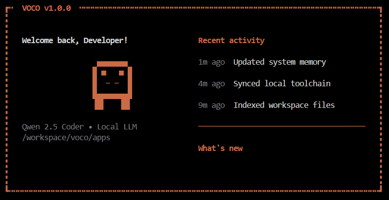

# VOCO Autonomous Agent

<div align="center">

**A local-first Windows automation agent with fast deterministic routing, tool-first execution, and a Textual UI.**




</div>

---

## What VOCO does

VOCO runs fully on your machine and executes real desktop/browser actions through a controlled orchestrator:

- browser automation (navigate, type, click, key actions)
- desktop actions (open apps, Notepad workflows, screenshots, audio controls)
- file/index search flows for local retrieval
- specialized deterministic pipelines (YouTube comment export, codegen autofix, report generation)
- push-to-talk voice input with lightweight transcription defaults

The runtime is designed around **hybrid routing**:
1. deterministic fast paths for common/critical intents
2. route-family contracts and classifier guardrails
3. tool-first decomposition
4. LLM fallback only when needed

---

## Architecture at a glance

| Layer | File(s) | Responsibility |
|---|---|---|
| UI | `voco_ui.py` | Terminal dashboard, task queue, progress visualization, voice toggle |
| Orchestrator | `orchestrator.py` | Planning, retries, policy checks, execution loop |
| Router | `router.py` | Intent + argument extraction, route-family prediction/guardrails |
| Tools | `tools.py`, `tools/` | Browser/OS/file/codegen/document pipelines |
| Memory | `memory.py`, `memory/` | Profile/history/context persistence and indexing |
| Evaluation | `eval.py`, `test_decomp.py` | Regression suite + benchmark gate |

---

## Prerequisites

- Windows 10/11
- Python 3.10+
- [Ollama](https://ollama.com/) installed and available in PATH
- Playwright browser dependencies (first-run install)

Model used by default:
- `qwen3:4b`

---

## Quick start

```bash
python -m venv .venv
.venv\Scripts\activate
pip install -r requirements.txt
playwright install chromium
```

Launch VOCO (recommended):

```bash
run_voco_admin.bat
```

Or launch directly:

```bash
python voco_ui.py
```

---

## Configuration knobs

Core runtime settings are in `constants.py`:

- `OLLAMA_MODEL`, `OLLAMA_URL`
- context/timeouts: `OLLAMA_NUM_CTX_*`, `OLLAMA_REQUEST_TIMEOUT_SECONDS`
- autonomy: `AUTONOMY_MODE`, `HUMAN_APPROVAL_DISABLED`
- hybrid routing:
  - `ROUTER_HYBRID_MODE`
  - `ROUTE_CONTRACTS_ENABLED`
  - `ROUTE_CLASSIFIER_GUARD_ENABLED`
  - `ROUTE_CLASSIFIER_MIN_CONFIDENCE`

---

## Evaluation and regression checks

Run reliability suite:

```bash
python eval.py suite
```

Run benchmark suite:

```bash
python eval.py benchmark
```

Run misroute guardrail regressions:

```bash
python eval.py benchmark --category misroute --no-gate
```

Run decomposition regression test:

```bash
python test_decomp.py
```

---

## Repository layout

```text
.
├─ assets/
├─ memory/
├─ models/
├─ prompts/
├─ tools/
├─ voice/
├─ constants.py
├─ router.py
├─ orchestrator.py
├─ tools.py
├─ voco_ui.py
├─ eval.py
└─ run_voco_admin.bat
```

---

## Branch policy

- `main`: stable production-ready line
- `canary`: pre-release hardening line for upcoming pushes

Both branches should stay in sync for validated production changes.

---

## Security and hygiene

- Runtime/generated artifacts are excluded via `.gitignore`
- Vault templates are tracked; live vault content is not
- No secrets or machine-local caches should be committed

---

## License

This project is released under the terms in [`LICENSE`](LICENSE).
