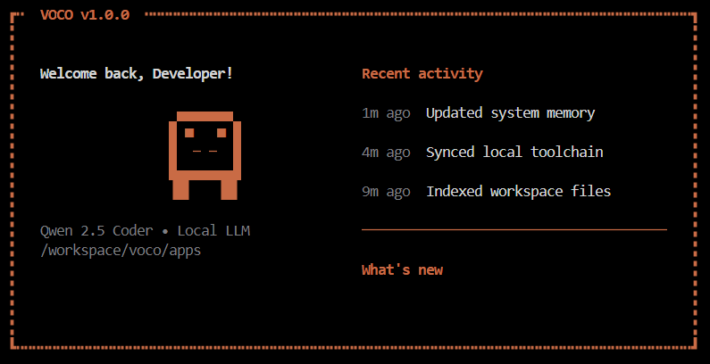

# VOCO - Local Windows Automation Agent


VOCO is a **local-first AI assistant** for Windows.  
It runs in terminal UI and tries to do tasks step by step (open apps, mute audio, screenshots, file tasks, browser tasks).

---

## UI Preview



---

## What VOCO is (simple)

VOCO has 3 main parts:

1. **UI (`voco_ui.py`)**  
   You type commands in a clean terminal dashboard.
2. **Orchestrator (`orchestrator.py`)**  
   This is the brain loop. It decides what to run and executes tools.
3. **Tools (`tools.py`)**  
   Real actions like mute/unmute, screenshot, browser navigation, and file operations.

---

## What we completed

We implemented the full Phase-1 build and major fixes:

- Qwen/Ollama chat integration
- JSON action-plan parser flow
- Windows tool registry (browser + OS + file + profile tools)
- TUI wired to real orchestrator in background thread
- Evaluation pipeline (`eval.py`) with 20 prompts
- Memory vault files in `memory/vault/`
- Better UI logging (fixed garbled `[voco]` style output)
- Better LLM error messages for HTTP 500 / timeout
- **Local fast-path** for basic commands (`mute`, `un-mute`, screenshot, running apps)
- **Dual-model selection + fallback logic** (fast vs heavy candidates)

---

## Important current behavior

### 1) Basic commands now work fast without LLM
For simple commands, VOCO bypasses model planning and executes directly.

Examples:
- `mute the system audio`
- `un-mute the system audio`
- `ur-mute the system audio` (typo handled)

### 2) Hard commands still depend on local model health
If your machine has low free RAM/VRAM, heavy model tasks can still fail or timeout.

---

## Known issue (current)

On low-memory sessions, Ollama can return:

- `HTTP 500: model requires more system memory ...`
- or request timeout

This is not a UI crash.  
This is a model runtime resource issue.

---

## Quick start

## 1) Install dependencies

```powershell
pip install playwright pyautogui pygetwindow pywin32 pynput keyboard pyyaml scikit-learn joblib textual rich pillow pytesseract pywinauto requests
python -m playwright install chromium
```

## 2) Ensure Ollama is running

```powershell
ollama serve
```

If you can, install at least one smaller model for fallback:

```powershell
ollama pull qwen2.5:1.5b
```

## 3) Run VOCO UI

```powershell
python voco_ui.py
```

---

## Project structure

```text
Sem4-AIOT/
├── readme.md
├── voco_ui.py
├── orchestrator.py
├── llm.py
├── tools.py
├── _prompt.py
├── context.py
├── memory.py
├── constants.py
├── eval.py
├── memory/
│   └── vault/
│       ├── USER.yaml
│       ├── HISTORY.jsonl
│       ├── CONTEXT.md
│       └── failures.jsonl
└── assets/
    └── ui-screenshot.png
```

---

## Evaluation snapshot

From the first full 20-prompt run:

- Success rate: **5.0%**
- Format failure rate: **95.0%**
- Main blocker: model timeout / memory pressure

This is why local fast-path and model fallback were added.

---

## Next best technical steps

1. Install at least one small fallback model (`qwen2.5:1.5b` or `qwen2.5:0.5b`)
2. Add stronger intent routing for more local actions
3. Add command queue + cancellation in UI
4. Improve browser tool reliability and selector strategies
5. Re-run `python eval.py` and compare new metrics

---

## Final note

VOCO is now much more usable for daily basic commands on this device.  
For complex tasks, stability still depends on Ollama model memory headroom.

